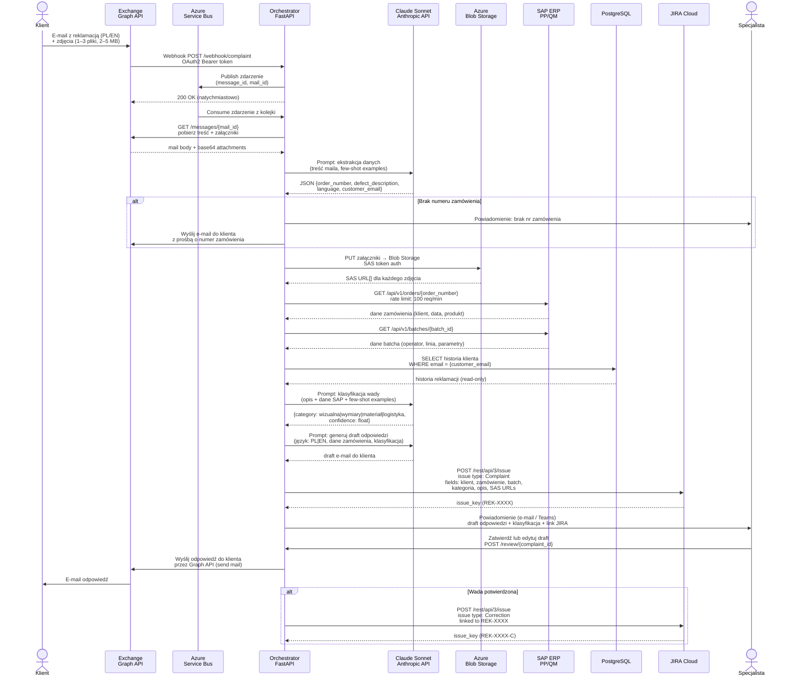

# Przepływ danych między systemami

## Diagram sekwencji

---

## Kluczowe aspekty przepływu

### Asynchroniczność i niezawodność
Orchestrator odpowiada webhookowi natychmiast (`200 OK`), zanim rozpocznie jakiekolwiek przetwarzanie. Właściwy pipeline uruchamiany jest przez Azure Service Bus — gwarantuje dostarczenie zdarzenia nawet przy chwilowej awarii orchestratora (dead-letter queue po 3 nieudanych próbach).

### Rate limiting SAP
SAP ERP dopuszcza 100 req/min. Przy szczycie sezonowym (2000 reklamacji/miesiąc ≈ ~3 req/min średnio, ale lokalnie więcej) Service Bus naturalnie throttluje ruch. Orchestrator implementuje exponential backoff przy odpowiedzi `429 Too Many Requests`.

### OAuth2 — Microsoft Graph API
Orchestrator używa service account z zakresem `Mail.Read` + `Mail.Send`. Token odświeżany automatycznie przed wygaśnięciem (TTL: 1h). Brak interakcji użytkownika przy uwierzytelnianiu.

### Azure Blob Storage — SAS tokens
Zdjęcia uploadowane z unikalnym SAS URL ważnym 30 dni. URL dołączany do ticketu JIRA — dział jakości ma bezpośredni dostęp bez logowania do Blob Storage.

### PostgreSQL — read-only
Orchestrator łączy się jako użytkownik tylko do odczytu. Baza klientów nie jest modyfikowana przez pipeline — zapis danych reklamacji odbywa się wyłącznie w JIRA.
